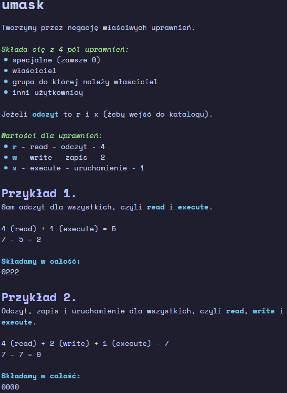

# Diagnostyka systemu Linux

Zobacz [ podsumowanie](#podsumowanie).

Oprócz poleceń warto rozumieć 📁 **strukturę systemu plików Linux'a**. Fiszki programu Anki dotyczące folderów znajdziesz tutaj: [kliknij tutaj](https://www.github.com/jozwikaleksander/inf02/flashcards/Linux%20File%20System%20Structure.apkg)

## lsblk

Podaje informacje na **temat  dysku twardego**. Aby wyświetlić konkretne
informacje skorzystaj z **przełącznika -o** i podaj nazwy kolumn.

### Najważniejsze kolumny

- **NAME** - nazwa urządzenia
- **FSTYPE** - system plików
- **MODEL** - model urządzenia
- **SERIAL** - numer seryjny
- **SIZE** - pojemność urządzenia

**Przykład**

## lscpu

Podaje informacje o ** procesorze**.

**Niektóre z informacji które możemy znaleźć:**

- Nazwa
- Taktowanie
- Liczba rdzeni
- Wielkość pamięci L1 Cache
- Wielkość pamięci L2 Cache

**Przykład**

## lspci

Wyświetla urządzenia PCI w tym ** kartę graficzną** i ** kartę sieciową**.

### Karta graficzna

**Użyta komenda:** lspci -v | more

### Karta sieciowa

**Użyta komenda:** lspci -v | more

## Plik /etc/os-release

Podaje **nazwę** i **wersje systemu operacyjnego**.

**Przykład**

Aby wyświetlić zawartość pliku korzystam z polecenia **cat**.

## uname

Podaje m.in. ** wersję jądra (przełącznik -r)** i ** architekturę (przełacznik -p)**.

### Wersja jądra

### Architektura

## dmidecode

Dostarcza informacji na temat m.in. **pamięci RAM, procesorze, płycie głównej**. Aby wybrać konkretne urządzenie skorzystaj z przełącznika **-t**.

### Pamięć RAM

**Użyta komenda:** dmidecode -t memory

### Płyta główna

**Użyta komenda:** dmidecode -t baseboard

## top

Wyświetla **procesy** oraz **informacje o zasobach komputera**.

**Przykład**

**Informacje które możemy odczytać to między innymi:**

- liczba uruchomionych procesów
- liczba uśpionych procesów
- ilość wolnej pamięci RAM
- ilość używanej pamięci RAM

## du

Wyświetla rozmiar katalogu. Aby wygodnie wyświetlić wyniki skorzystaj
z przełączników **-h** i **-s**.

### Rozmiar katalogu /etc

**Użyta komenda:** du -sh /etc

### Rozmiar katalogu /var

**Użyta komenda:** du -sh /var

## hostname

Wyświetla nazwę hosta.

## Plik /etc/passwd

Zawiera listę wszystkich użytkowników wraz z ich UID, GID, ścieżką do katalogu domowego i używaną powłoką.

**Przykład:**

**1000 - UID**

**100 - GID**

Jeżeli nie pamiętasz, które jest które użyj polecenia [id](#id).

## id

Wyświetla **UID** i **GID** określonego użytkownika.

## Podsumowanie

| Informacja                           | Polecenie                                         |
| ------------------------------------ | ------------------------------------------------- |
|  Karta graficzna                    | lspci -v \| more [](#lspci)                      |
|  Karta sieciowa                     | lspci -v \| more [](#lspci)                      |
|  Nazwa i wersja system operacyjnego | /etc/os-release [](#plik-etcos-release)          |
|  Wersja jądra                       | uname -r [](#uname)                              |
|  Architektura                       | uname -p [](#uname)                              |
|  Pamięć RAM                         | dmidecode -t memory [](#dmidecode)               |
|  Płyta główna                       | dmidecode -t baseboard [](#dmidecode)            |
|  Procesy i zasoby komputera         | top [](#top)                                     |
| 猪 Rozmiar katalogu                  | du [](#du)                                       |
|  Nazwa hosta                        | hostname [](#hostname)                           |
|  Używana powłoka                    | /etc/passwd [](#plik-etc-passwd)                 |
| פּ Ścieżka do katalogu domowego       | /etc/passwd [](#plik-etc-passwd)                 |
|  UID i GID użytkownika              | /etc/passwd [](#plik-etc-passwd) lub id [](#id) |

# Konfiguracja serwera tekstowego Open Suse 42.3

## Konfiguracja interfejsów

### Dodanie bramy domyślnej

### Zmiana nazwy serwera

### Wyłączenie interfejsu

## Serwer HTTP

- ** Nazwa usługi:** apache2
- ** Nazwa pakietu:** yast2-http-server
- ** Domyślny właściciel:** wwwrun
- ** Grupa właściciela:** www
- **ﴘ Domyślny numer portu**: 80 (TCP)
- ** Katalog do plików konfiguracyjnych:** /etc/apache2
- ** Domyślna ścieżka strony**: /srv/www
- ** Link do dokumentacji: [kliknij tutaj](https://doc.opensuse.org/documentation/leap/reference/html/book-reference/cha-apache2.html)**

## Serwer FTP

### Informacje o usłudze

- ** Nazwa usługi:** vsftpd
- ** Nazwa pakietu:** vsftpd lub yast2-ftp-server
- ** Plik konfiguracyjny:** /etc/vsftpd.conf
- **ﴘ Domyślne numery portów**: 20 (przesył danych), 21 (polecenia) (TCP)
- ** Domyślna ścieżka do udostępnionych plików**: /srv/ftp
- ** Link do dokumentacji: [kliknij tutaj](https://doc.opensuse.org/documentation/leap/reference/html/book-reference/cha-ftp.html)**

### Przypomnienie

#### Uwierzytelnieni i anonimowi

** Użytkownik anonimowy** - każdy kto chce skorzystać z serwera nie mając przy tym swojego konta. Zazwyczaj można się połączyć anonimowo korzystając z login'u: **anonymous** lub wybierając odpowiednie ustawienie/przełącznik.

** Użytkownik uwierzytelniony** - posiada własne konto w naszym serwerze.

#### Umask

#### Łączenie się / testowanie serwera FTP
**Program PuTTY** - umożliwia połączenie się z innym hostem (za pomocą protokołów telnet, ssh, ftp itp.). W przypadku FTP będziemy korzystać z narzędzia **psftp** (które wchodzi w skład PuTTY). Aby pobrać **PuTTY** [kliknij tutaj](https://putty.org/)

**Sposoby na połączenie się z serwerem FTP:**
  - Przeglądarka Internet Explorer
  - Narzędzia ftp w wierszu poleceń
  - Eksplorator plików
  - Filezilla lub PuTTY

</article>

### Konfiguracja serwera

 dla użytkowników anonimowych i uwierzytelnionych oraz podaj ścieżkę do katalogów.](img/FTP/3.png)

](img/FTP/9.png)

## Serwer DNS

### Informacje o usłudze

- ** Nazwa usługi:** named
- ** Nazwa pakietu:** yast2-dns-server
- ** Plik konfiguracyjny:** /etc/named.conf
- **ﴘ Domyślne numery portów**: 53 (UDP i TCP)
- ** Link do dokumentacji: [kliknij tutaj](https://doc.opensuse.org/documentation/leap/reference/html/book-reference/cha-dns.html#sec-dns-bind)**

Przed nauką konfiguracji serwera DNS warto nauczyć się teorii, zestaw fiszek programu Anki: [kliknij tutaj](https://www.github.com/jozwikaleksander/inf02/flashcards/DNS.apkg).

<article>
**Dla przypomnienia:**

- **strefa wyszukiwania w przód** - example.com -> 192.168.1.1
- **strefa wyszukiwania w tył** - 192.168.1.1 -> example.com
- **rekord A** to nazwa na IPv4 - example.com -> 192.168.1.1
- **rekord NS** - identyfikuje serwer nazw
- **rekord CNAME** - przechowuje alias, który pozwala na przypisaniu wielu rekordów do tego samego hosta.
- Tworzenie nazwy strefy wyszukiwania w przód polega na odwróceniu adresu sieci i dodaniu in-addr.arpa na końcu. **Na przykład:**

        Adres sieci: 10.0.0.0
        Nazwa strefy: 0.0.10.in-addr.arpa

- Do testowania użyj polecenia **nslookup** (na Linuxie i Windows'ie) lub **dig** (na Linux'ie).
</article>

### Konfiguracja serwera

### Testowanie serwera

## Serwer DHCP

- ** Nazwa usługi:** dhcpd
- ** Nazwa pakietu:** yast2-dhcp-server
- ** Plik konfiguracyjny:** /etc/dhcpd.conf
- **ﴘ Domyślne numery portów**: 67 (serwer) i 68 (klient) - UDP
- ** Link do dokumentacji:** [kliknij tutaj](https://doc.opensuse.org/documentation/leap/reference/html/book-reference/cha-dhcp.html)
