# 1.Diagnostyka systemu Linux

## 1.1. lsblk
Podaje informacje na **temat  dysku twardego**. Aby wyświetlić konkretne
informacje skorzystaj z **przełącznika -o** i podaj nazwy kolumn.

### 1.1.1. Najważniejsze kolumny

- **NAME** - nazwa urządzenia
- **FSTYPE** - system plików
- **MODEL** - model urządzenia
- **SERIAL** - numer seryjny
- **SIZE** - pojemność urządzenia

**Przykład**

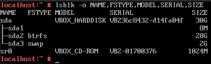

## 1.2. lscpu
Podaje informacje o **  procesorze**.

**Niektóre z informacji które możemy znaleźć:**

- Nazwa
- Taktowanie
- Liczba rdzeni
- Wielkość pamięci L1 Cache
- Wielkość pamięci L2 Cache

**Przykład**

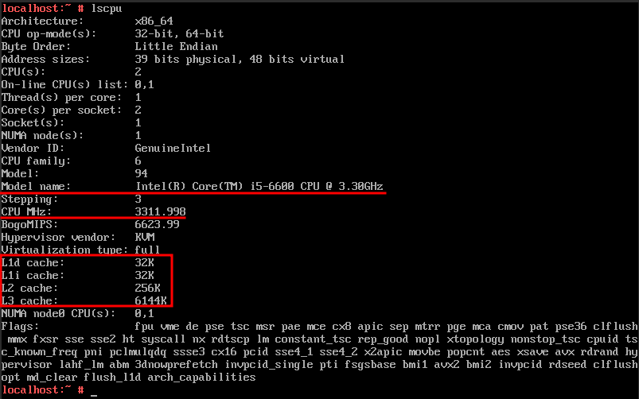

## 1.3. lspci
Wyświetla urządzenia PCI w tym ** kartę graficzną** i ** kartę sieciową**.

### 1.3.1. Karta graficzna

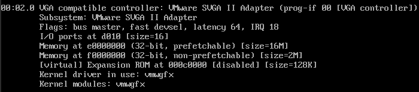

**Użyta komenda:** lspci -v | more

### 1.3.2. Karta sieciowa

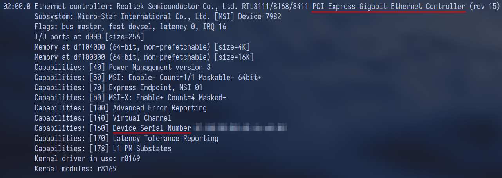

**Użyta komenda:** lspci -v | more

## 1.4. Plik /etc/os-release
Podaje **nazwę** i **wersje systemu operacyjnego**.

**Przykład**

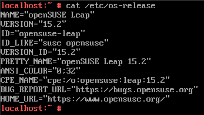

Aby wyświetlić zawartość pliku korzystam z polecenia **cat**.

## 1.5. uname
Podaje m.in. ** wersję jądra (przełącznik -r)** i ** architekturę (przełacznik -p)**.

### 1.5.1. Wersja jądra

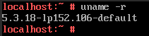

### 5.2. Architektura

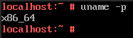

## 1.6. dmidecode
Dostarcza informacji na temat m.in. **pamięci RAM, procesorze, płycie głównej**. Aby wybrać konkretne urządzenie skorzystaj z przełącznika **-t**.

### 1.6.1. Pamięć RAM
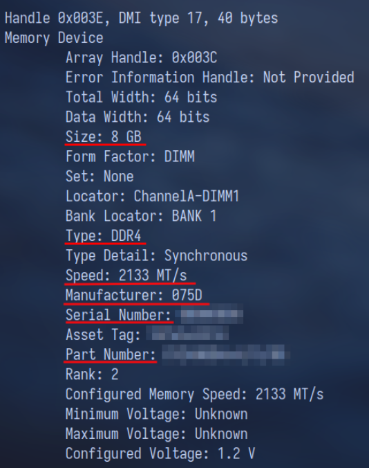

**Użyta komenda:** dmidecode -t memory

### 1.6.2. Płyta główna
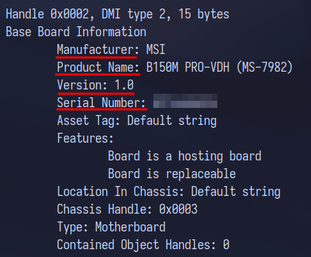

**Użyta komenda:** dmidecode -t baseboard

## 1.7. top
Wyświetla **procesy** oraz **informacje o zasobach komputera**.

**Przykład**
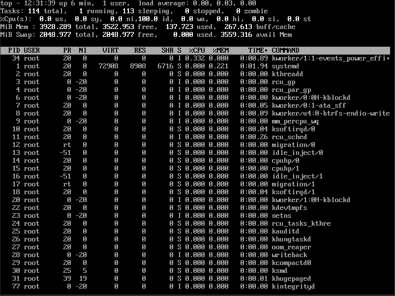

**Informacje które możemy odczytać to między innymi:**

- liczba uruchomionych procesów
- liczba uśpionych procesów
- ilość wolnej pamięci RAM
- ilość używanej pamięci RAM

## 1.8. du
Wyświetla rozmiar katalogu. Aby wygodnie wyświetlić wyniki skorzystaj
z przełączników **-h** i **-s**.

### 1.8.1. Rozmiar katalogu /etc

**Użyta komenda:** du -sh /etc

### 1.8.2. Rozmiar katalogu /var

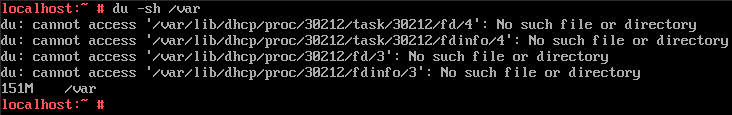

**Użyta komenda:** du -sh /var

## 1.9. hostname
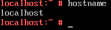

Wyświetla nazwę hosta.

## 1.10. Plik /etc/passwd
Zawiera listę wszystkich użytkowników wraz z ich UID, GID, ścieżką do katalogu domowego i używaną powłoką.

**Przykład:**

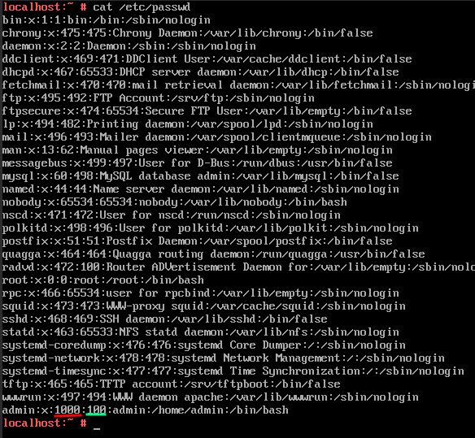

**1000 - UID**

**100 - GID**

Jeżeli nie pamiętasz, które jest które użyj polecenia [id](#id).

## 1.11. id
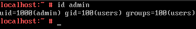

Wyświetla **UID** i **GID** określonego użytkownika.