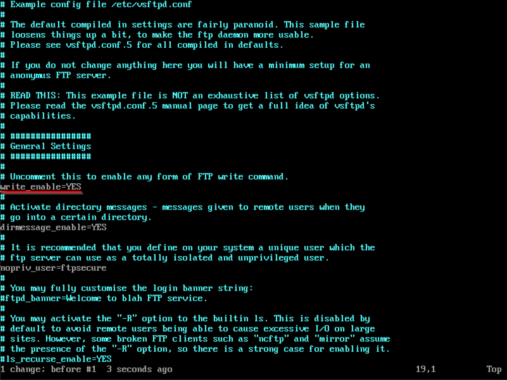
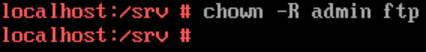
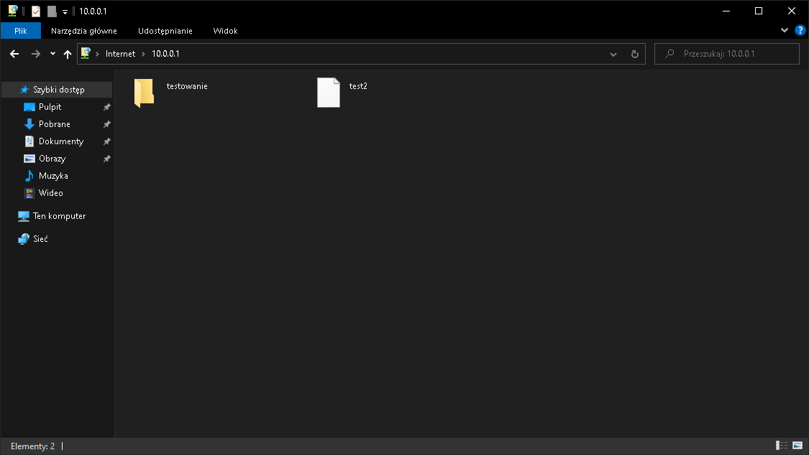
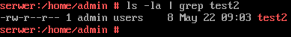

<main>
# Diagnostyka systemu Linux

Zobacz [ podsumowanie](#podsumowanie).

Oprócz poleceń warto rozumieć 📁 **strukturę systemu plików Linux'a**. Fiszki programu Anki dotyczące folderów znajdziesz tutaj: [kliknij tutaj](https://www.github.com/jozwikaleksander/inf02/flashcards/Linux%20File%20System%20Structure.apkg)

## lsblk

Podaje informacje na **temat  dysku twardego**. Aby wyświetlić konkretne
informacje skorzystaj z **przełącznika -o** i podaj nazwy kolumn.

### Najważniejsze kolumny

- **NAME** - nazwa urządzenia
- **FSTYPE** - system plików
- **MODEL** - model urządzenia
- **SERIAL** - numer seryjny
- **SIZE** - pojemność urządzenia

**Przykład**

## lscpu

Podaje informacje o ** procesorze**.

**Niektóre z informacji które możemy znaleźć:**

- Nazwa
- Taktowanie
- Liczba rdzeni
- Wielkość pamięci L1 Cache
- Wielkość pamięci L2 Cache

**Przykład**

## lspci

Wyświetla urządzenia PCI w tym ** kartę graficzną** i ** kartę sieciową**.

### Karta graficzna

**Użyta komenda:** lspci -v | more

### Karta sieciowa

**Użyta komenda:** lspci -v | more

## Plik /etc/os-release

Podaje **nazwę** i **wersje systemu operacyjnego**.

**Przykład**

Aby wyświetlić zawartość pliku korzystam z polecenia **cat**.

## uname

Podaje m.in. ** wersję jądra (przełącznik -r)** i ** architekturę (przełacznik -p)**.

### Wersja jądra

### Architektura

## dmidecode

Dostarcza informacji na temat m.in. **pamięci RAM, procesorze, płycie głównej**. Aby wybrać konkretne urządzenie skorzystaj z przełącznika **-t**.

### Pamięć RAM

**Użyta komenda:** dmidecode -t memory

### Płyta główna

**Użyta komenda:** dmidecode -t baseboard

## top

Wyświetla **procesy** oraz **informacje o zasobach komputera**.

**Przykład**

**Informacje które możemy odczytać to między innymi:**

- liczba uruchomionych procesów
- liczba uśpionych procesów
- ilość wolnej pamięci RAM
- ilość używanej pamięci RAM

## du

Wyświetla rozmiar katalogu. Aby wygodnie wyświetlić wyniki skorzystaj
z przełączników **-h** i **-s**.

### Rozmiar katalogu /etc

**Użyta komenda:** du -sh /etc

### Rozmiar katalogu /var

**Użyta komenda:** du -sh /var

## hostname

Wyświetla nazwę hosta.

## Plik /etc/passwd

Zawiera listę wszystkich użytkowników wraz z ich UID, GID, ścieżką do katalogu domowego i używaną powłoką.

**Przykład:**

**1000 - UID**

**100 - GID**

Jeżeli nie pamiętasz, które jest które użyj polecenia [id](#id).

## id

Wyświetla **UID** i **GID** określonego użytkownika.

## lshw

Wyświetla informacje na **temat sprzętu komputera**. Są to informacje dotyczące m.in.** CPU**,  ** NIC**, ** dyski**, **  karty dźwiękowe**, <strong> __USB</strong>, itp.

## Podsumowanie

| Informacja                           | Polecenie                                         |
| ------------------------------------ | ------------------------------------------------- |
|  Karta graficzna                    | [lspci -v \| more](#lspci)                      |
|  Karta sieciowa                     | [lspci -v \| more](#lspci)                      |
|  Nazwa i wersja system operacyjnego | [/etc/os-release](#plik-etcos-release)          |
|  Wersja jądra                       | [uname -r](#uname)                              |
|  Architektura                       | [uname -p](#uname)                              |
|   Pamięć RAM                         | [dmidecode -t memory](#dmidecode)               |
|  Płyta główna                       | [dmidecode -t baseboard](#dmidecode)            |
|  Procesy i zasoby komputera         | [top](#top)                                     |
| 猪 Rozmiar katalogu                   | [du](#du)                                       |
|  Nazwa hosta                        | [hostname](#hostname)                           |
|  Używana powłoka                    | [/etc/passwd](#plik-etc-passwd)                 |
| פּ Ścieżka do katalogu domowego       | [/etc/passwd](#plik-etc-passwd)                 |
|  UID i GID użytkownika              | [/etc/passwd](#plik-etc-passwd)_lub [id ](#id) |

# Konfiguracja serwera tekstowego Open Suse 42.3

## Konfiguracja interfejsów

### Dodanie bramy domyślnej

### Zmiana nazwy serwera

### Wyłączenie interfejsu

## Serwer HTTP

- ** Nazwa usługi:** apache2
- ** Nazwa pakietu:** yast2-http-server
- ** Domyślny właściciel:** wwwrun
- ** Grupa właściciela:** www
- **ﴘ Domyślny numer portu**: 80 (TCP)
- ** Katalog do plików konfiguracyjnych:** /etc/apache2
- ** Domyślna ścieżka strony**: /srv/www
- ** Link do dokumentacji: [kliknij tutaj](https://doc.opensuse.org/documentation/leap/reference/html/book-reference/cha-apache2.html)**

## Serwer FTP

### Informacje o usłudze

- ** Nazwa usługi:** vsftpd
- ** Nazwa pakietu:** vsftpd lub yast2-ftp-server
- ** Plik konfiguracyjny:** /etc/vsftpd.conf
- **ﴘ Domyślne numery portów**: 20 (przesył danych), 21 (polecenia) (TCP)
- ** Domyślna ścieżka do udostępnionych plików**: /srv/ftp
- ** Link do dokumentacji: [kliknij tutaj](https://doc.opensuse.org/documentation/leap/reference/html/book-reference/cha-ftp.html)**

### Przypomnienie

#### Uwierzytelnieni i anonimowi

** Użytkownik anonimowy** - każdy kto chce skorzystać z serwera nie mając przy tym swojego konta. Zazwyczaj można się połączyć anonimowo korzystając z login'u: **anonymous** lub wybierając odpowiednie ustawienie/przełącznik.

** Użytkownik uwierzytelniony** - posiada własne konto w naszym serwerze.

#### Umask
Tworzymy przez **negację właściwych uprawnień**.

**Składa się z 4 pól uprawnień:**

-  _specjalne (zawsze 0)
-  _właściciel
-   _grupa do której należy właściciel
-  _inni użytkownicy

Jeżeli **odczyt** to r i x (żeby wejść do katalogu).

**Wartości dla uprawnień:**

- **r** - read - odczyt - 4
- **w** - write - zapis - 2
- **x** - execute - uruchomienie - 1

##### Przykład 1.
Sam odczyt dla wszystkich, czyli **read** i **execute**.

4 (read) + 1 (execute) = 5
7 - 5 = 2

**Składamy w całość:**
0222

##### Przykład 2.
Odczyt, zapis i uruchomienie dla wszystkich, czyli **read**, **write** i **execute**.

4 (read) + 2 (write) + 1 (execute) = 7
7 - 7 = 0

**Składamy w całość:**
0000

#### Łączenie się / testowanie serwera FTP
**Program PuTTY** - umożliwia połączenie się z innym hostem (za pomocą protokołów telnet, ssh, ftp itp.). W przypadku FTP będziemy korzystać z narzędzia **psftp** (które wchodzi w skład PuTTY). Aby pobrać **PuTTY** [kliknij tutaj](https://putty.org/)

**Sposoby na połączenie się z serwerem FTP:**
  - Przeglądarka Internet Explorer
  - Narzędzia ftp w wierszu poleceń
  - Eksplorator plików
  - Filezilla lub PuTTY

</article>

### Konfiguracja serwera

 dla użytkowników anonimowych i uwierzytelnionych oraz podaj ścieżkę do katalogów.](img/FTP/3.png)

](img/FTP/9.png)

## Serwer DNS

### Informacje o usłudze

- ** Nazwa usługi:** named
- ** Nazwa pakietu:** yast2-dns-server
- ** Plik konfiguracyjny:** /etc/named.conf
- **ﴘ Domyślne numery portów**: 53 (UDP i TCP)
- ** Link do dokumentacji: [kliknij tutaj](https://doc.opensuse.org/documentation/leap/reference/html/book-reference/cha-dns.html#sec-dns-bind)**

Przed nauką konfiguracji serwera DNS warto nauczyć się teorii, zestaw fiszek programu Anki: [kliknij tutaj](https://www.github.com/jozwikaleksander/inf02/flashcards/DNS.apkg).

<article>
**Dla przypomnienia:**

- **strefa wyszukiwania w przód** - example.com -> 192.168.1.1
- **strefa wyszukiwania w tył** - 192.168.1.1 -> example.com
- **rekord A** to nazwa na IPv4 - example.com -> 192.168.1.1
- **rekord NS** - identyfikuje serwer nazw
- **rekord CNAME** - przechowuje alias, który pozwala na przypisaniu wielu rekordów do tego samego hosta.
- Tworzenie nazwy strefy wyszukiwania w przód polega na odwróceniu adresu sieci i dodaniu in-addr.arpa na końcu. **Na przykład:**

        Adres sieci: 10.0.0.0
        Nazwa strefy: 0.0.10.in-addr.arpa

- Do testowania użyj polecenia **nslookup** (na Linuxie i Windows'ie) lub **dig** (na Linux'ie).
</article>

### Konfiguracja serwera

### Testowanie serwera

## Serwer DHCP

- ** Nazwa usługi:** dhcpd
- ** Nazwa pakietu:** yast2-dhcp-server
- ** Plik konfiguracyjny:** /etc/dhcpd.conf
- **ﴘ Domyślne numery portów**: 67 (serwer) i 68 (klient) - UDP
- ** Link do dokumentacji:** [kliknij tutaj](https://doc.opensuse.org/documentation/leap/reference/html/book-reference/cha-dhcp.html)

# SSH - Secure Shell

## Kopiowanie plików

### Polecenie scp

Do kopiowania plików z serwera SSH i SFTP służy polecenie **scp**.

Pamiętaj, że po połączeniu się z **ssh lądujemy w katalogu użytkownika** (np. /home/admin).

#### Format komendy 

<strong>  _Pobieranie z serwera:</strong>

    scp [-r] uzytkownik@adres_serwera:plik_zrodlowy plik_docelowy

Przykład: [kliknij tutaj](#przyklad-1.)

<strong>  _Wysyłanie do serwera:</strong>

    scp [-r] plik_zrodlowy uzytkownik@adres_serwera:plik_docelowy

**-r** - kopiuje/wysyła wszystkie pliki wewnątrz danego katalogu.

Zamiast adresu serwera możemy też podać <strong>  _nazwę hosta</strong>.

<strong>  _Przykład 1.</strong>

    scp admin@10.0.0.1:/etc/os-release wersja_systemu

Skopiuje to **plik /etc/os-release** z serwera do **pliku wersja_systemu** na kliencie.

<strong>  _Przykład 2.</strong>

    scp test admin@10.0.0.1:test2

Wysyłamy **plik test** z klienta do **pliku test2** na serwerze.

### Połączenie przez sftp

Oprócz [scp](#polecenie-scp) możemy połączyć się przez **SFTP - Secure File Transfer Protocol (TCP 22)**. Wtedy obowiązują nas komendy tj. w zwykłym ftp, czyli **get** (pobieranie z serwera) lub **put** (wysyłanie do serwera).

## Źródła i ciekawe artykuły
- [SSH vs SSL](https://kinsta.com/knowledgebase/ssh-vs-ssl/)
- [Polecenia unix'a](http://www.is.umk.pl/~grochu/unix/unix-2020/S10.html)

# Egzamin próbny

<h4>Uwaga!</h4>
Część zadań pominąłem, w tym montaż okablowania, konfiguracja drukarki i spisywanie wyników pamięci RAM. 

## Treść zadania
1. Wykonaj montaż okablowania sieciowego:
	- podłącz kabel U/UTP do panelu krosowego według sekwencji **T568B**
	- drugiego końca kabla U/UTP wtyk 8P8C według sekwencji **T568B**
2. Skonfiguruj interfejsy sieciowego routera z Wi-Fi według zaleceń.
	1. włączona obsługa **VLAN 802.1Q**
	2. sieć VLAN o nazwie **VLAN1 i ID = 1**
	3. sieć VLAN o nazwie **VLAN2 i ID = 2**
	4. adres IP dla interfejsu powiązanego z siecią VLAN1: **192.168.0.X/24**
	5. adres IP dla interfejsu powiązanego z siecią VLAN2: **192.168.1.X/24**
	6. port 2 przypisany z tagowaniem do sieci VLAN o ID=1 i ID=2
	7. **włącz routing między sieciami** **VLAN**
	8. **serwer DHCP włączony** dla sieci **VLAN2**
	9. **ustawiona pula adresowa DHCP (dla VLAN2):** 192.168.1.100-192.168.1.150
	10. **domyślna brama serwera dla klientów DHCP:** 192.168.1.X
	11. **adres bramy serwera dla klientów DHCP:** 192.168.1.X
	12. **adres serwera DNS dla klientów DHCP:** 192.168.0.200+X
3. **Skonfiguruj przełącznik według zaleceń**
	- **adres IP:** 192.168.0.100+X z maską 255.255.255.0, gdzie X to twój numer z dziennika
	- **brama domyślna IP routera** dla interfejsu powiązanego z VLAN1, jeżeli jest wymagana
	- włączona obsługa VLAN 802.1Q
	- utworzona sieć VLAN o nazwie VLAN1 i ID=1
	- utworzona sieć VLAN o nazwie VLAN2 i ID=2
	- port 1 przypisany **bez tagowania** (tryb dostępu) do VLAN o **ID=1**
	- port 2 przypisany **bez tagowania** (tryb dostępu) do VLAN o **ID=2**
	- port 3 przypisany z **tagowaniem** do **VLAN1** i **VLAN2**
4. Za pomocą kabli połączeniowych podłącz urządzenia zgodnie ze schematem.
5. Skonfiguruj interfejsy sieciowe serwera w systemie Linux oraz stacji roboczej w systemie Windows zgodnie z zaleceniami.
	- interfejs sieciowy serwera podłączony do przełącznika
		- **nazwa połączenia:** VLAN1
		- **adres IP:** 192.168.0.200+X z maską 255.255.255.0
		- **brama domyślna:** adres IP routera dla interfejsu powiązanego z VLAN1
		- **serwer DNS:** localhost
	- interfejs sieciowy stacji roboczej
		- nazwa połączenia: VLAN2
		- adres IP: automatycznie
	- za pomocą poleceń systemowych wykonaj test komunikacji stacji roboczej z routerem, przełącznikiem.
6. W katalogu głównym serwera **utwórz folder /stronawww**, a w nim **plik index.html** zawierający tekst:

		<html>
			<body>
				
"Próbny egzamin zawodowy Kwalifikacja INF.02"

			</body>
		</html>

- ustaw **właściciela** utworzonego katalogu i pliku na użytkownika i grupę na uprawnieniach, na których działa serwer HTTP.
- **skonfiguruj serwer HTTP** tak, aby główna witryna udostępniała zawartość /stronawww.
1. Na stacji roboczej zainstaluj **drukarkę sieciową** na lokalnym porcie TCP/IP. Adres IP drukarki 192.168.0.200.
2. Utwórz **plik tekstowy** zawierający twój numer stanowiska egzaminacyjnego i twój numer PESEL, wydrukuj go na drukarce. Dołącz wydruk arkusza egzaminacyjnego potwierdzając prawidłową instalację drukarki.
3. Na stacji roboczej na pulpicie użytkownika Administrator znajdują się wyniki **testowania pamięci RAM**. Na ich podstawie uzupełnij tabelę:
<table>
<tbody>
  <tr>
    <th rowspan="4">RAM 1</th>
    <td>Typ pamięci</td>
    <td>__________________</td>
  </tr>
  <tr>
    <td>Slot</td>
    <td>__________________</td>
  </tr>
  <tr>
    <td>Przepustowość [MB/s]</td>
    <td>__________________</td>
  </tr>
  <tr>
    <td>Częstotliwość</td>
    <td>__________________</td>
  </tr>
  <tr>
    <th rowspan="4">RAM 1</th>
    <td>Typ pamięci</td>
    <td>         </td>
  </tr>
  <tr>
    <td>Slot</td>
    <td>         </td>
  </tr>
  <tr>
    <td>Przepustowość [MB/s]</td>
    <td>         </td>
  </tr>
  <tr>
    <td>Częstotliwość</td>
    <td>         </td>
  </tr>
</tbody>
</table>
1. Na stacji roboczej sprawdź czy **wyświetla się udostępniona witryna**.

Czas przeznaczony na wykonanie zadania wynosi **150 min**.

**Ocenie podlegać będą 4 rezultaty:**

- wykonane okablowanie sieciowe i połączenie fizyczne urządzeń,
- skonfigurowane urządzenia sieciowe
- skonfigurowane interfejsy sieciowe serwera i stacji roboczej
- skonfigurowany serwer sieci Web i połączenie z drukarką sieciową.
- przebieg wykonania kabla połączeniowego i połączenia urządzeń.

## Konfiguracja router'a
**Model urządzenia:** Cisco RW110W

**Emulator:** [kliknij tutaj](https://www.cisco.com/assets/sol/sb/RV110W_Emulators/RV110W_Emulator_v1.0.0.2/default.asp.htm)

Aby dostać się do urządzenia podłączam go do stacji i **konfiguruje automatyczne pobieranie adresu IP** (domyślnie DHCP jest włączony na routerze). Następnie wchodzę do konfiguracji przy użyciu przeglądarki, adres IP to **192.168.1.1**.

1. Obsługa **standardu 802.1Q** (dot1Q) jest już domyślnie włączona.
2. Jako, że **VLAN 1** jest **domyślnym** VLAN'em, a utworzenie VLAN 2 jest **niemożliwe** zamienimy ID na kolejno **10** i **20**. W celu ich utworzenia kierujemy się do **Networking>LAN>LAN configuration** i tworzymy odpowiednie **VLAN'y**. Następnie wykluczam domyślny VLAN 1 ze wszystkich portów oprócz ostatniego (ewentualnie jako furtka gdyby coś poszło nie tak).
3. Zmieniam adresy IP dla poszczególnych VLAN'ów. Pamiętaj, że po każdej zmianie adresów router będzie chciał się **zrestartować**, w razie potrzeby zmień adres IP na komputerze lub odśwież go (*ipconfig /release i ipconfig /renew*).
	- **Dla VLAN 1** ustawiam wybrany adres (inny niż dla VLAN 1 i VLAN 2, w tym przypadku wybrałem 5). Zostawiam sobie serwer DHCP. 
	- Dla VLAN 10 ustawiam adres 192.168.0.1 z prefiksem /24. Zgodnie z poleceniem wyłączam serwer DHCP. 
	- Dla **VLAN 20** ustawiam **adres 192.168.1.1** z prefiksem /24. Konfiguruje również serwer DHCP, **adres początkowy zostaje niezmieniony**, natomiast **maksymalna liczba użytkowników** zostaje zmieniona na **51** (o jeden większa niż różnica 150 i 100, jeżeli zapomnisz jak to działa na egzaminie zawsze możesz sprawdzić ustawioną pulę po zapisaniu ustawień). Ustawiam też **adres serwera DNS** na adres serwera, czyli 192.168.0.200. 
	- Teraz zostaje nam włączenie routowania między VLAN'ami, czyli **Inter-VLAN routing**. Rozwiązanie, które tutaj tworzymy to tzw. **router na patyku** ([więcej informacji znajdziesz tutaj](https://contenthub.netacad.com/legacy/RSE/5.02/pl/course/module5/5.1.1.3/5.1.1.3.html)).

## Konfiguracja przełącznika
**Model przełącznika:** Cisco SG 200-8G

**Emulator:** [kliknij tutaj](https://www.cisco.com/assets/sol/sb/SG200_Emulators/SG200_Emulator_v1-2-9/config/home_SG_200-50P_1_2_9.htm)

 1. Przełącznik domyślnie ma adres **192.168.1.254/24**, więc musimy na stacji ustawić adres w tej podsieci (np. 192.168.1.1/24).

    

 2. Po wejściu na przełącznik i zmianie hasła, przechodzimy do **VLAN Management>Create VLAN**.

    

    Następnie tworzymy VLAN'y 10 i 20.

    

3. Teraz pora zmienić domyślny VLAN na 10, poprzez **VLAN management>Default VLAN settings**.
4. Następnie przypisujemy VLAN'y do interfejsów.
	- zmieniliśmy domyślny VLAN, dlatego VLAN 1 nie jest już przypisany do żadnego portu.
	- VLAN 10 przypisuje do portu g1(nie tagowany - Untagged) i portu g3 (tagowany - Tagged).
	- VLAN 20 przypisuje do portu g2(nie tagowany - Untagged) i portu g3 (tagowany - Tagged).
5. W ustawieniach interfejsów (**VLAN Management>Interface settings**) zmieniamy typy interfejsów g1 i g2 na access (tryb dostępu, jeden VLAN na jednym porcie) i g3 na trunk (wiele VLAN'ów na jednym porcie).

## Konfiguracja komputerów
### Konfiguracja serwera
- Zaczynam od konfiguracji serwera, otwieram **Yast'a** i przechodzę do **System** i **Network Settings**.
  
  
- Wybieram **interfejs** i klikam **Edit (F4)**. 
  
  
- **Wpisuje statyczny adres IP:** 192.168.0.200 (powinno być 201 🙂) i podaje **hostname**: serwer.
  
  
- Przechodzę do zakładki **General** i zmieniam nazwę interfejsu na **VLAN1**, zapisuje ustawienia interfejsu klikając **F10**.
  
  
- Przechodzę do zakładki **Hostname/DNS** i upewniam się, że hostname jest ustawiony oraz, że **serwer DNS** to **localhost**, czyli 127.0.0.1. 
  
  
- W zakładce **Routing** dodaje nową **trasę domyślną**, czyli adres bramy domyślnej (routera) - **192.168.0.1**, podaje też nazwę interfejsu - **VLAN1**.
  
  

### Konfiguracja klienta
- Zmieniam ustawienia karty sieciowej na automatyczne pobieranie adresu IP i adresu serwera DNS.

## Testowanie połączeń

- Serwer -> Router (VLAN 1)
  
  
- Serwer -> Router (VLAN 2)
  
  
- Serwer -> Klient
  
  
- Serwer -> Przełącznik
  
  
- Klient -> Router (VLAN 1)!
  
  

- Klient -> Serwer
  
    

## Konfiguracja serwera HTTP

Jeżeli ćwiczysz instalacje **serwera HTTP** w wirtualnej maszynie, to może się zdarzyć, że pomimo wybrania usługi HTTP podczas instalacji usługa **Apache2** jest niezainstalowana. W takim przypadku wystarczy ją zainstalować poleceniem:

		sudo zypper install yast2-http-server

1. Otwieram **Yast**'a i przechodzę do **Network Services>Server HTTP**.
2. Wpisuje **niestandardowe porty** i **interfejsy** na których mamy nasłuchiwać, w tym przypadku zostawiam wszystko domyślnie (HTTP działa na porcie TCP 80).
3. W trzecim kroku kreatora (Default Host) zmieniam ścieżkę do katalogu dokumentu (**Document Root** i **Directory**) według zadania, czyli w tym przypadku /stronawww.
4. Zmieniam ustawienia uruchamiania serwera HTTP.
5. Tworzę **katalog /stronawww**, a wewnątrz **plik index.html**.
6. Za pomocą dowolnego edytora tekstu **zmieniam zawartość pliku**, ja wybrałem **vim** (możesz użyć nano lub mc jeżeli są zainstalowane).
7. Pozostało nam sprawdzenie działania serwera HTTP na kliencie.
</main>